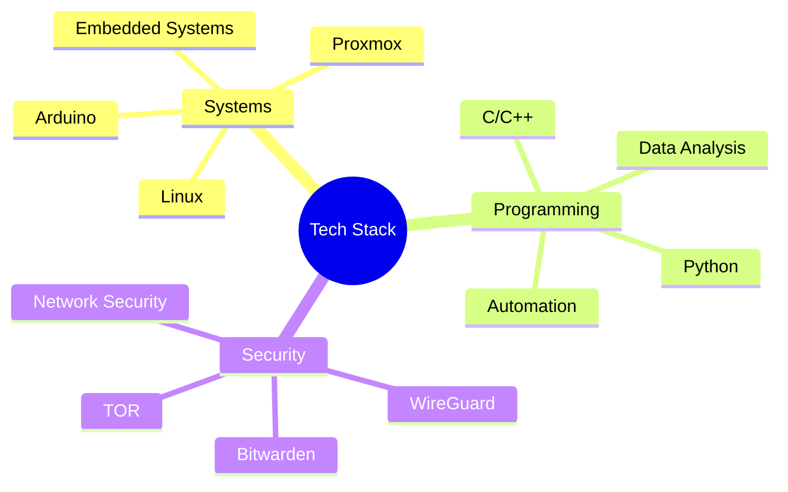

<div align="center">
  
# 👨‍💻 Systems Engineering & Technology Enthusiast

[](https://github.com/vetronics)
[](https://twitter.com/vetronics)

</div>

## 🎯 About Me

> "Building tomorrow's systems, one line of code at a time"

I'm a passionate **Junior Systems Engineer** with a deep fascination for the intricate world of technology. My expertise lies in:

- 🐧 Linux Systems Engineering & Administration
- 🤖 Robotics & Embedded Systems Development
- 🔒 Privacy-Focused Solutions & Cybersecurity
- 🏗️ Infrastructure Automation & Scripting

<details>
<summary>🌟 What Sets Me Apart</summary>

- Strong advocate for practical, efficient solutions over complexity
- Hands-on experience with both hardware and software integration
- Focus on security-first approach in system design
- Passionate about open-source contributions
</details>

## 🔧 Technical Arsenal

<div align="center">

### Core Technologies


</div>

### 💻 Development & Tools


### 🛡️ Security & Networking


### 📊 Data & Analytics


## 🎯 Current Focus

```python
current_projects = {
    "Robotics": "Developing autonomous navigation systems using Arduino",
    "Infrastructure": "Building scalable home-lab with Proxmox virtualization",
    "Security": "Implementing privacy-focused networking solutions",
    "Automation": "Creating efficient system management scripts"
}
```

## 📈 GitHub Analytics

<div align="center">

[](https://github.com/vetronics)

[](https://github.com/vetronics)

</div>

## 🎓 Learning Path

- 📚 Currently diving deeper into:
  - Advanced Linux System Administration
  - Embedded Systems Programming
  - Network Security Protocols
  - Infrastructure as Code (IaC)

## 🤝 Let's Connect

<div align="center">

[](https://linkedin.com/in/vetronics)
[](mailto:your.email@domain.com)
[](https://vetronics.github.io)

</div>

---

<div align="center">
  
[](https://visitcount.itsvg.in)

<i>Let's build something amazing together!</i>

</div>
