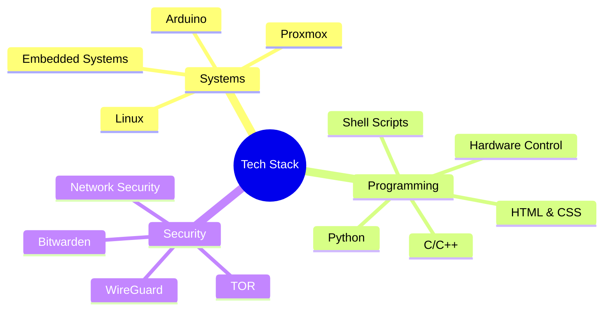

# 👨‍💻  Junior Systems Engineering & Infrastructure Specialist

## 👋 About Me

I am Vetronics, a Junior Systems Engineering & Infrastructure Specialist with a deep passion for technology, robotics, telecommunications, and server systems. I am preparing to study cybersecurity at ITS to further expand my technical expertise. My interests include everything about technical engineering, and my skills reflect my dedication to hands-on problem solving and innovative system solutions.

---

## 💡 Technical Focus

### Core Technologies

### Systems Expertise
- **Linux Administration**  
  - System optimization and service management
- **Embedded Systems**  
  - Hardware integration and real-time programming
- **Virtualization**  
  - Proxmox environment, resource management, and container solutions
- **Web Fundamentals**  
  - Solid foundation in HTML & CSS for static website development and UI prototyping

### Development Approach
> Specialized in procedural and functional programming, with no OOP dependencies

#### Programming Style:
- Clean, straightforward C/C++ implementations
- Procedural Python scripting
- Direct hardware manipulation
- Functional programming patterns
- Semantic and accessible HTML & CSS layouts

## 🔧 Core Competencies

### System Engineering & Infrastructure
- **Virtualization:** Proxmox | KVM | Container Management
- **Architecture:** System Design | Infrastructure Planning
- **Automation:** Procedural Scripts | Process Optimization
- **Hardware:** Arduino | Embedded Systems | Custom Solutions

### Development & Tools

### Security Tools

## 🚀 Current Projects

### System Optimization
- Low-level system performance enhancements
- Hardware-software interface solutions
- Privacy-focused networking tools
- Resource-efficient automation scripts

### Web Development
- HTML & CSS landing pages and static content sites

### Industrial Automation Internship
- Internship in a company specializing in industrial automation.
- Developed Python scripts for configuring the ESP32-S3 via serial communication.
- Installed MicroPython firmware on the ESP32-S3, executed automation scripts, and performed functional testing.
- Implemented automated debug file generation based on successful operations.

## 🏆 Featured Achievements & Awards

### RoboCup Junior Academy — Soccer Entry & Soccer Entry Lightweight Leagues (Robotics)
- **European RoboCup 2025, Bari (Soccer Entry Lightweight):**  
  🏅 Winner, Super Team (collaborating with Croatia, Slovenia, and Italy)
- **National RoboCup 2025, Pescara (Soccer Entry):**  
  🏅 5th Place Overall
- **National RoboCup 2024, Verbania (Soccer Entry):**  
  🏅 Best Design Award (Technical Prize)

- Specialized in designing, building, and programming autonomous robots for competitive environments.
- Focused on rapid prototyping, embedded control, team collaboration, and real-time problem-solving.

---

## 📈 Technical Metrics

## 🔬 Technical Focus Areas

### Current Learning Path
- Studying cybersecurity fundamentals at ITS
- Efficient procedural patterns for embedded systems
- Scalable virtualization strategies

### Key Interests
- Direct hardware manipulation
- Low-level system optimization
- Procedural automation solutions
- Resource-efficient implementations

`Systems` • `Security` • `Automation` • `Infrastructure` • `Robotics` • `Web Fundamentals`

*Focused on efficient, procedural solutions in system engineering, web development with HTML & CSS, and robotics innovation (RoboCup Junior Academy—Soccer Entry Lightweight: European RoboCup 2025 Bari, Super Team Winner; Soccer Entry: National RoboCup 2025 Pescara, 5th Place & 2024 Verbania, Best Design Award). Currently advancing in cybersecurity and industrial automation.*

